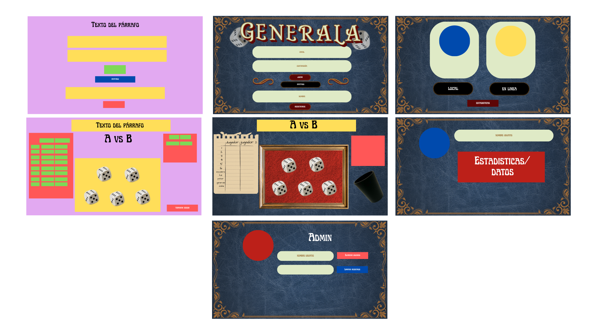
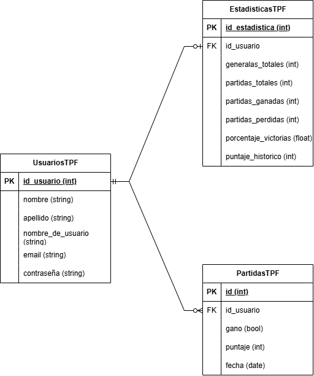

# 2026-TPF-G11

## Generala
### Descripción general
Va a ser una generala que sigue las reglas originales del juego que se va a poder jugar de a dos jugadores de forma local (misma PC) u online (dos PCs distintas). El usuario va a poder editar su nombre y foto de perfil. El admin va a poder agregar, eliminar y modificar usuarios y las partidas de los mismos.
### Problemática/necesidad
Buscamos preservar un juego de mesa y una estética antigua de forma digital.
### Público objetivo
Cualquiera que busque divertirse jugando con dados y con algún amigo, aunque va a estar pensado especialmente para jugar con la familia en la exposición (padres, abuelos, hijos, nietos, etc.).
### Objetivo general
Entretener y unir a familia y amigos.
### Principales funcionalidades
Un inicio de sesión, que te envía a la página de admin en caso de ingresar con esa cuenta y que si no te envía a la página de selección de modo de juego. Desde ahí se puede ir a la página del usuario donde se pueden ver las partidas jugadas y personalizar el perfil. Una vez elegido si quiere jugar de forma local u online se direcciona al jugador a la página de juego, donde podrá jugar contra su oponente.

### Bocetos

### DER

### División del trabajo
| Tarea | Responsable | Fecha estimada |
| ----- | ----------- | -------------- |
| Back  | Todos       | 14/10          |
| Inicio de sesión | Allievi y Baldesari | 19/10 |
| Admin | Ibarzabal y Kutianski | 19/10 |
| Modo de juego | Allievi y Baldesari | 30/10 |
| Página de usuario | Ibarzabal y Kutianski | 13/11 |
| Juego | Allievi y Baldesari | 13/11 |
| Arreglo de errores | Todos | 19/11 |

### Hitos
| Hito | Fecha estimada |
| ----- | -------------- |
| Inicio de sesión y página de admin | 19/10 |
| Modo de juego | 30/10 |
| Juego y página de usuario | 13/11 |
| Arreglo de errores | 19/11 |
