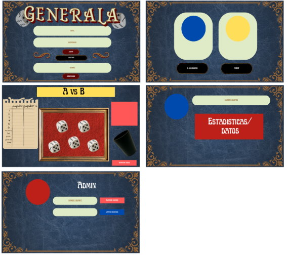

# 2026-TPF-G11

## Generala
### Descripción general
Va a ser una generala que sigue las reglas originales del juego que se va a poder jugar local u online de a 2 jugadores. El usuario va a poder editar su nombre de usuario y foto de perfil, el admin va a poder agregar, eliminar y modificar usuarios y las partidas de los mismos.
### Problemática/necesidad
Buscamos preservar un juego de mesa y una estética antigua de forma digital.
### Público objetivo
Cualquiera que busque divertirse jugando con dados y con algún amigo, aunque va a estar especialmente diseñado para jugar con familia (padres, abuelos, hijos, nietos, etc.).
### Objetivo general
Entretener y unir a familia y amigos.
### Principales funcionalidades
Un inicio de sesión, que te envía a la página de admin en caso de ingresar con esa cuenta y que si no te envía a la página de selección de modo de juego, desde ahí se puede ir a la página del usuario donde se pueden ver las partidas jugadas y personalizar el perfil, una vez elegido si quiere jugar de forma local u online, se direcciona al jugador a la página de juego, donde podrá jugar contra su oponente.

### Bocetos

